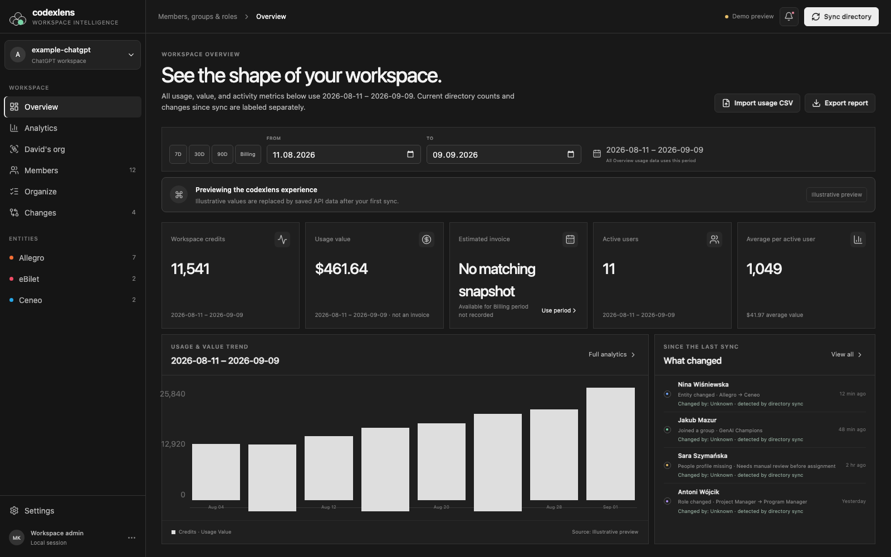
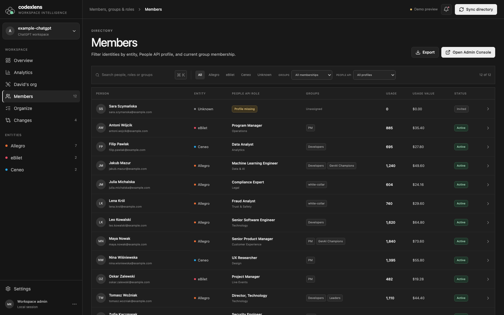

# codexlens

`codexlens` is a locally runnable workspace control surface for ChatGPT members,
groups, People API enrichment, entity reporting, usage imports, and change
notifications.

The interface deliberately follows the restrained, dark Admin Console visual
language while using a bubble-cluster mark to represent overlapping groups.

## Why codexlens exists

OpenAI's Admin Console is the source of truth for workspace access and billing,
but a budget or access owner still has to join several operational views by
hand. It does not combine the company's people hierarchy with Codex usage,
explain invoice ownership by management subtree, map HR roles and entities to
multiple access groups, or preserve a simple “what changed since my last sync”
view in one place.

Codexlens closes that manageability gap without replacing OpenAI's controls. It
adds a local decision and reporting layer around the Admin APIs and People API:

- explain workspace spend by person, group, entity, and direct-manager subtree
- reconcile every management allocation to 100% of the selected invoice
- plan and review multi-group membership from People API roles and entities
- identify ungrouped users, missing profiles, overlapping assignments, and
  directory changes before acting
- keep credentials and synchronized personnel data local

## Screenshots

All screenshots below use fictional demo users and synthetic values. They do
not contain synchronized workspace, personnel, billing, or credential data.





## What works

- synchronizes members and groups from a workspace-scoped ChatGPT Admin API key
- enriches each member from People API by exact email match
- separates Allegro, eBilet, Ceneo, and unresolved entity records
- shows missing People API profiles before other members
- manages manual group membership with confirmation and post-write verification
- prevents edits to groups identified as SCIM-managed
- provides a dedicated **Organize** tab for filtering by People API role and
  entity, previewing assignments to PM, Developers, white-collar, and SEC, and
  applying explicitly reviewed additions
- stores snapshots locally and reports field-level changes between syncs
- records who added a member when the upstream directory explicitly returns an
  inviter, identifies SCIM provisioning, and marks unavailable actors as unknown
- synchronizes daily per-user Codex credit usage from the Codex Analytics API
- imports normalized per-user usage CSV files as a fallback and calculates workspace, group,
  entity, and active-user averages without double-counting workspace totals
- stores a configurable price per credit and shows usage value for the
  workspace, every member, entity, group, and active-user average
- stores a manual OpenAI Billing snapshot for current balance and unbilled
  overage, and uses it as the selected period's estimated invoice reference
- provides daily, weekly, and monthly analytics with custom date ranges plus
  entity and group filters
- estimates the invoice for the selected Analytics period and filters by
  calibrating against the saved billing-period overage, and shows the same
  proportional estimate for each group
- supports a billing-cycle budget, configurable alert threshold, and workspace
  overage limit; budget targets are prorated to unfiltered selected periods
- compares every selection with the immediately preceding equal-length period,
  forecasts open-period cost, and shows daily burn, budget variance, adoption,
  top-user concentration, median/P90 user cost, and directory exceptions
- switches the trend between estimated invoice cost, usage value, and raw usage,
  and shows cost, share, and cost-per-active-user for users, groups, and entities
- keeps every usage metric on Overview within one clearly selected period,
  defaulting to the saved Billing period when available
- filters Members by current group, no group, multiple groups, and People API
  profile status
- provides a dedicated **David's org** tab that resolves David Roberts's direct
  managers and their full reporting subtrees through People API, then shows each
  team's usage, share of David's organization, fraction of the whole workspace
  invoice, and allocated estimated invoice cost
- clearly labels demo, saved, and live data states

## Run locally

Requirements: Node.js 22.13 or newer.

```bash
npm install
cp .env.example .env.local
npm run dev
```

Open [http://localhost:3000](http://localhost:3000).

Use [http://localhost:3000/?demo=1](http://localhost:3000/?demo=1) for a
non-persistent preview containing only fictional records.

On this machine, `.env.local` is an ignored symbolic link to the previously
created private environment file. The admin key is not committed.

## Environment

Create a workspace-scoped Admin key in Admin Console with only the permissions
needed by your workflow:

- Users: Read
- Group Management: Read for sync, Write for membership changes
- Codex analytics API: Read (`codex.enterprise.analytics.read`)

The minimum local configuration is:

```dotenv
CHATGPT_ADMIN_KEY=your_workspace_admin_key
CHATGPT_WORKSPACE_ID=your_workspace_id
CHATGPT_WORKSPACE_NAME=your_workspace_name
CODEX_ANALYTICS_HISTORY_DAYS=365
PEOPLE_API_BASE_URL=https://people.allegrogroup.com
MANAGEMENT_LEADER_NAME=David Roberts
```

`CHATGPT_ADMIN_KEY` is read only by server routes. Never prefix it with
`NEXT_PUBLIC_`, and never commit `.env.local`.

## Credential and data safety

- `.env*` is ignored except for the placeholder-only `.env.example`.
- `.wrangler/`, exports, build output, and local SQLite/D1 state are ignored.
- Admin keys are consumed only in server routes and are never returned to the
  browser or written to application logs.
- The repository contains synthetic demo identities only; screenshots must be
  captured through `?demo=1`.
- Before publishing, scan both the working tree and Git history for API-key
  patterns and workspace data. Rotating a key remains mandatory if it was ever
  committed, even if history is later rewritten.

## Usage data

Each **Sync directory** run also requests daily, per-user credit usage from:

```text
GET /v1/analytics/codex/workspaces/{workspace_id}/usage
```

The Admin key must belong to the selected workspace and include **Codex
analytics API: Read**. Sync loads the previous 365 days by default; set
`CODEX_ANALYTICS_HISTORY_DAYS` to a value from 1 through 3650 to change the
window. The API's cursor pages are followed automatically, and existing daily
rows are updated rather than duplicated.

If the analytics permission is missing, directory sync still succeeds and the
result banner explains the analytics failure. As a fallback, **Import usage
CSV** accepts these columns:

```csv
email,period_start,period_end,credits,messages
person@example.com,2026-08-01,2026-08-31,1240,290
```

Use `tokens` instead of `credits` for token reports, or `cost` for USD. A `unit`
column can override the inferred unit. Unmatched emails are counted and skipped.

Set the contract-specific **price per credit** and reporting currency from the
Settings panel. Codexlens calculates:

```text
usage value = attributed credits × price per credit
```

New installations default to **$0.04 USD per credit**. The value remains
editable and is stored locally for the workspace.

Usage value is a planning metric, not an invoice. Committed credits and
workspace overage are separate billing concepts. Direct `cost` imports are
treated as USD; token imports remain unpriced because a credit price cannot be
applied to tokens.

The selected-period invoice estimate is calibrated from the saved Billing
snapshot: reference overage cost divided by attributed credit usage in that
billing period produces an effective estimated invoice rate per used credit.
Codexlens applies that rate to the selected period, filters, and group rows.
This is an analytical allocation rather than an issued invoice. Because group
membership overlaps, group estimates must not be added together.

If imported rows contain direct USD `cost`, Analytics treats them as reported
cost instead of applying the credit allocation model. A configured billing-cycle
budget is a planning target for the saved Billing period. Unfiltered selections
receive a day-prorated target; filtered group and entity views show contribution
only and deliberately do not invent separate budgets.

The Analytics view supports custom date ranges, 7/30/90-day and month-to-date
presets, group and entity filters, daily/weekly/monthly buckets, budget and cost
KPIs, equal-period comparisons, open-period forecasts, finance signals, and
breakdowns by person, group, and entity. Each imported row is assigned
to the bucket containing its `period_end`. For accurate daily analytics, import
one row per user per day; wider source periods are flagged instead of being
silently spread across days.

The **David's org** view treats each People API direct report as a cost owner.
Codex users are walked up the full People API manager chain, so teams still
roll up correctly when an intermediate manager does not have Codex access.
Each team's invoice fraction is its attributed usage divided by total workspace
usage for the same period. The allocated estimated invoice uses that fraction
only when the saved Billing snapshot covers the selection; otherwise the share
remains visible and the app asks for a matching snapshot. An explicit outside-
organization/unresolved row reconciles the table to 100% of workspace usage and
invoice rather than silently dropping people.

API `turns` are stored in the existing activity-count field used by the UI's
message counters. Workspace-level aggregate rows are never spread across users;
only rows carrying a member ID or email are attributed.

## Addition attribution

Codexlens stores `added_at`, inviter name, inviter email, and attribution source
when the workspace user response explicitly provides those fields. SCIM-managed
members are labeled as identity-provider additions. If the directory endpoint
does not return an actor, Codexlens shows **Unknown — not provided by directory
API**; it never infers an inviter from the person who happened to run a later
sync.

For complete historical attribution, an Enterprise Compliance API collector is
the appropriate future source, subject to the event coverage and retention of
the workspace. Existing snapshot events predate actor capture and remain labeled
as legacy events.

The workspace total sums each person once. Group totals can overlap because one
person may belong to several groups, so group totals must not be added together
to reconstruct the workspace total.

## Group organizer

The dedicated **Organize** tab follows the agreed rules:

- product management, UX, research, program, project, and process management → PM
- software, data, machine learning, engineering, platform, QA, IT, and analyst roles → Developers
- fraud and compliance → white-collar
- security and cybersecurity → SEC
- missing or ambiguous People API profiles → Review first; never auto-assign
- other matched roles → Review first, then choose a manual destination group

The organizer persists configurable exact-role-to-groups and entity-to-groups
mappings in local D1. Each role or entity can target several manual groups, and
a person can receive both kinds of mappings; duplicate destinations are merged.
Role mappings can be searched and filtered by zero, one, or multiple destination
groups. Saving mappings never writes to OpenAI. A generated addition plan must
still be reviewed and confirmed.

The organizer can also be filtered by exact People API role, department/search text,
entity, assignment status, and suggested destination. You can use the agreed
rules or deliberately select a manual destination group. It selects additions
only, excludes existing memberships and SCIM targets, shows a final grouped
summary, and requires confirmation before applying changes. Failed assignments
remain selected for review or retry. Individual manual group changes are also
available from a member profile and require confirmation.

## Data and safety model

- Durable local state uses the project-local D1/SQLite emulator under
  `.wrangler/`; it is ignored by Git.
- The first sync establishes a baseline and creates no noisy “everyone joined”
  events. Later syncs compare role, department, manager, entity, workspace role,
  status, and group membership.
- Change events keep actor provenance. Changes made inside Codexlens retain the
  signed-in ChatGPT identity when hosting headers are available; a local session
  is explicitly shown as an unknown local admin.
- Remote writes are limited to explicit, confirmed manual group membership
  operations and are verified by reading the group back.
- SCIM-controlled membership remains owned by the identity provider.
- Production credentials and locally synchronized people data are not part of
  the repository.

## Reporting semantics

OpenAI's Codex Analytics API supplies workspace-scoped aggregated activity for
reporting. It is not a raw audit-event feed and does not grant access or change
permissions. In Codexlens, Analytics API and attributed CSV rows describe
activity; the Billing snapshot supplies the manually recorded invoice reference;
People API supplies organizational dimensions.

Committed credits, consumed credits, unbilled overage, a planning budget, and an
issued invoice are intentionally separate. Reports can lag, so reconciliation
should always compare the source timestamp and exact billing period. Usage and
cost are operational indicators; they do not by themselves establish business
value or savings.

## Commands

```bash
npm run dev          # local app
npm run build        # production build
npm run lint         # code quality
npm test             # build and app-level checks
npm run db:generate  # regenerate schema migrations
```

See [docs/architecture.md](docs/architecture.md) for the system boundaries and
next implementation increments.

This repository contains the application source, not a GitHub Pages build.
Codexlens requires server-side secrets, API calls, and durable local data, which
cannot be provided safely by a static GitHub Pages deployment.

## OpenAI references

- [Managing Admin keys in Admin Console](https://help.openai.com/en/articles/20001407-managing-admin-keys-in-admin-console)
- [Workspace analytics for ChatGPT Enterprise and Edu](https://help.openai.com/en/articles/10875114-user-analytics-for-chatgpt-enterprise-and-edu-public-beta)
- [Codex Analytics API](https://learn.chatgpt.com/docs/enterprise/analytics-api)
- [ChatGPT Work usage and cost](https://learn.chatgpt.com/docs/enterprise/chatgpt-work-usage-and-cost)
- [Compliance API and audit events](https://learn.chatgpt.com/docs/enterprise/compliance-api)
- [Groups in ChatGPT Enterprise and Edu](https://help.openai.com/en/articles/9083985-groups-in-chatgpt-enterprise-and-edu)
